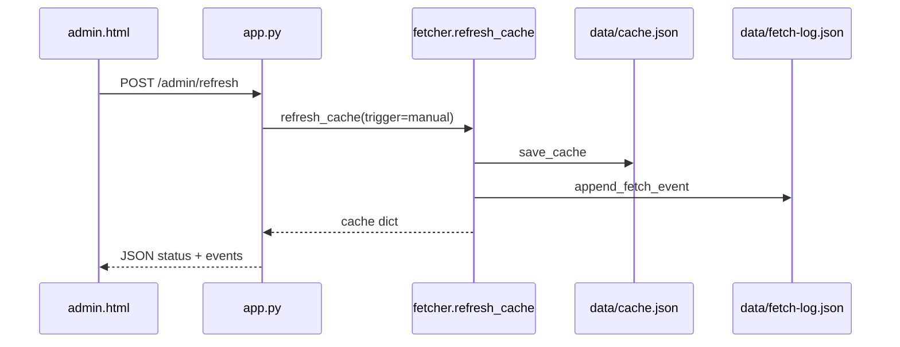

# Admin Panel Implementation Plan

## Assumptions about your existing code

1. **[`fetcher.refresh_cache()`](fetcher.py)** is the **only** function that performs a full cache refresh (called from [`scheduler.py`](scheduler.py) on startup and every 15 minutes). Manual refresh should call this same function, not duplicate API logic.
2. **[`cache.json`](data/cache.json) `last_updated`](data/cache.json)** is the timestamp of the **last refresh attempt**, not the last **fully successful** fetch. It is updated even when CoinGecko or NewsAPI fails (`stale: true`). The admin panel needs a **separate** `last_successful_fetch` field.
3. **No admin auth exists today.** `/admin` and `POST /admin/refresh` will be open unless you add protection (recommended: optional `ADMIN_TOKEN` in [`.env`](.env), checked on POST only).
4. **Module split follows your project convention:** JSON file I/O in its own module ([`favorites.py`](favorites.py) pattern), business logic in [`fetcher.py`](fetcher.py), routes only in [`app.py`](app.py).
5. **Record count** means cached row counts: `len(coins)` and `len(news)` from normalized [`load_cache()`](fetcher.py), not favorites or fetch-log entries.

---

## `data/fetch-log.json` schema

```json
{
  "events": [
    {
      "timestamp": "2026-06-02T18:30:00Z",
      "trigger": "manual",
      "status": "success",
      "coin_count": 50,
      "news_count": 20,
      "duration_ms": 8420,
      "errors": []
    }
  ]
}
```

| Field | Values | Notes |
|-------|--------|-------|
| `timestamp` | ISO UTC string | When refresh finished |
| `trigger` | `"startup"` \| `"scheduler"` \| `"manual"` | Passed into `refresh_cache(trigger=...)` |
| `status` | `"success"` \| `"partial"` \| `"failure"` | `success` = both APIs OK (`stale: false`); `partial` = one API OK; `failure` = neither API OK |
| `coin_count` / `news_count` | int | Length of lists written to cache |
| `duration_ms` | int | Wall-clock time for the refresh |
| `errors` | list of strings | Same messages as `cache.fetch_errors` |

**Cap rule:** prepend newest event, keep **max 10** (`events = [new] + events[:9]`).

Initial file: `{ "events": [] }` in [`data/fetch-log.json`](data/fetch-log.json).

---

## New routes ([`app.py`](app.py))

| Route | Method | Purpose |
|-------|--------|---------|
| `/admin` | GET | Render [`templates/admin.html`](templates/admin.html) with stats + log |
| `/admin/status` | GET | JSON snapshot for polling after refresh (optional but useful) |
| `/admin/refresh` | POST | Trigger immediate `refresh_cache(trigger="manual")`, return JSON result |

**`GET /admin/status` response shape:**

```json
{
  "coin_count": 50,
  "news_count": 50,
  "total_records": 70,
  "last_updated": "2026-06-02T18:30:00Z",
  "last_successful_fetch": "2026-06-02T17:58:03Z",
  "last_successful_fetch_display": "2026-06-02 11:58AM CST",
  "stale": false,
  "events": [ ... up to 10 ... ]
}
```

**`POST /admin/refresh` response:** same shape plus `"refreshed": true`. Return **409** if a refresh is already in progress (see step 3).

Routes call helpers only — no inline API or file logic.

---

## Where log-write logic hooks in

**Single hook point:** end of [`refresh_cache()`](fetcher.py), after `save_cache(data)` succeeds:

```python
def refresh_cache(trigger: str = "scheduler") -> dict:
    started = time.perf_counter()
    # ... existing fetch logic ...
    save_cache(data)
    append_fetch_event({...})          # fetch_log.py
    return data
```

Also update cache field **`last_successful_fetch`** inside `refresh_cache` when `status == "success"` (both APIs OK). On partial/failure, leave previous value intact (read from `previous` cache and carry forward in `data`).

**Call-site updates:**

- [`scheduler.py`](scheduler.py) line 27: `refresh_cache(trigger="startup")`
- [`scheduler.py`](scheduler.py) job: wrap as `lambda: refresh_cache(trigger="scheduler")` or use `functools.partial`
- [`app.py`](app.py) `POST /admin/refresh`: `refresh_cache(trigger="manual")`

---

## Frontend refresh button flow

In [`templates/admin.html`](templates/admin.html) + small script block (or [`static/admin.js`](static/admin.js)):

1. User clicks **Refresh now** → disable button, show spinner/text.
2. `fetch('/admin/refresh', { method: 'POST', headers: { 'X-Admin-Token': '...' } })` (token header only if you add auth).
3. On **200**: update stat cards and log table from JSON response (or re-fetch `GET /admin/status`).
4. On **409**: show “Refresh already in progress”.
5. On error: show message, re-enable button.

No full page reload required.

---

## Architecture



---

## Numbered implementation steps (dependency order)

1. **Create [`fetch_log.py`](fetch_log.py)** — mirror [`favorites.py`](favorites.py): `FETCH_LOG_PATH`, `load_fetch_log()`, `append_fetch_event(event)`, corrupt-file fallback to `{ "events": [] }`, cap at 10 entries.

2. **Seed [`data/fetch-log.json`](data/fetch-log.json)** with `{ "events": [] }`.

3. **Add a refresh lock in [`fetcher.py`](fetcher.py)** — module-level `threading.Lock` around the body of `refresh_cache()` so manual + scheduler refreshes cannot write [`cache.json`](data/cache.json) concurrently. Raise or return a sentinel if lock not acquired (route returns 409).

4. **Extend [`refresh_cache()`](fetcher.py)** — add `trigger: str = "scheduler"` param; compute `status`, `duration_ms`, counts; set `last_successful_fetch` on full success; carry forward on partial/failure; call `append_fetch_event()` after `save_cache()`.

5. **Extend cache schema in [`fetcher.py`](fetcher.py)** — add `last_successful_fetch` to `_empty_cache()`, `_normalize_cache()`, and the dict built in `refresh_cache()`. Update [`notes.md`](notes.md) architecture section.

6. **Update [`scheduler.py`](scheduler.py)** — pass `trigger="startup"` and `trigger="scheduler"` into `refresh_cache()`.

7. **Add admin helpers in [`fetcher.py`](fetcher.py)** (or `fetch_log.py`) — `get_admin_status() -> dict` combining `load_cache()`, `load_fetch_log()`, `format_last_updated()`, and computed counts. Keeps [`app.py`](app.py) thin.

8. **Add routes in [`app.py`](app.py)** — `GET /admin`, `GET /admin/status`, `POST /admin/refresh` calling helpers only.

9. **Build [`templates/admin.html`](templates/admin.html)** — Bootstrap layout matching existing theme; stat cards (coin count, news count, total, last successful fetch, last attempt); log table (10 rows); Refresh button + minimal JS `fetch()` handler; link back to `/`.

10. **Add styles in [`static/style.css`](static/style.css)** — `.admin-panel`, status badges for success/partial/failure, log table readable in light/dark themes.

11. **Optional hardening** — `ADMIN_TOKEN` in [`.env`](.env) / [`.env.example`](.env.example); validate on `POST /admin/refresh` (and optionally hide admin page). Document in [`README.md`](README.md).

12. **Verify** — `flask run` → visit `/admin` → confirm counts match cache → click Refresh now → new log entry at top → confirm scheduler refresh also logs with `trigger: "scheduler"` after 15 min (or temporarily lower interval in dev).

---

## What each admin UI component maps to

| Component | Data source |
|-----------|-------------|
| Cache record count | `len(cache["coins"])`, `len(cache["news"])`, sum as total |
| Last successful fetch | `cache["last_successful_fetch"]` formatted via existing `format_last_updated()` |
| Refresh now button | `POST /admin/refresh` → `refresh_cache(trigger="manual")` |
| Fetch event log (10) | `fetch-log.json` → `events` array, newest first |
