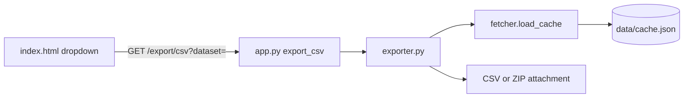

# CSV Cache Export Feature

## Goal

Let users download cached data from [`data/cache.json`](../data/cache.json) as CSV via a UI dropdown: **Coins**, **News**, or **Both** (ZIP containing `coins.csv` + `news.csv`).

## Architecture

| File | Role |
|------|------|
| [`exporter.py`](../exporter.py) | Build CSV bytes from cache (no Flask imports) |
| [`app.py`](../app.py) | `GET /export/csv` route — validate input, return file response |
| [`templates/index.html`](../templates/index.html) | Export dropdown in header |
| [`static/style.css`](../static/style.css) | Match existing header/theme styles |

No new pip dependencies — use stdlib `csv`, `io`, and `zipfile`.

## CSV schemas

**coins.csv** columns (from current cache):

`id`, `symbol`, `name`, `current_price`, `price_change_percentage_24h`, `market_cap_rank`, `ath`, `ath_change_percentage`, `genesis_date`, `image`

**news.csv** columns:

`title`, `description`, `source`, `published_at`, `url`

- Use `csv.writer` with proper quoting for commas/newlines in news descriptions.
- Empty/missing fields → blank cell; `None` handled safely.
- If cache is empty, still return a valid CSV with headers only (200, not an error).

## [`exporter.py`](../exporter.py) functions

- `VALID_DATASETS = {"coins", "news", "all"}`
- `build_coins_csv(coins: list) -> bytes`
- `build_news_csv(news: list) -> bytes`
- `build_export_zip(cache: dict) -> bytes`
- `build_export(dataset: str) -> tuple[bytes, str, str]` — returns `(content, filename, mimetype)`
- Filename date from `cache["last_updated"]` (YYYYMMDD) or today's UTC date if missing.
- Call [`load_cache()`](../fetcher.py) internally so exports always use normalized, safe data.

## Flask route ([`app.py`](../app.py))

- `GET /export/csv?dataset=coins|news|all`
- Validate dataset; return `Response` with `Content-Disposition: attachment`

## UI ([`templates/index.html`](../templates/index.html))

Bootstrap dropdown in header: Coins (CSV), News (CSV), Both (ZIP) — plain links, no JavaScript required.

## Edge cases

| Case | Behavior |
|------|----------|
| Empty cache | CSV with headers only / ZIP with empty-header CSVs |
| Corrupt cache | `load_cache()` normalization returns safe empty lists |
| Invalid `dataset` | 400 JSON error |
| News descriptions with quotes/commas | `csv.writer` proper quoting |

## Out of scope

- Exporting favorites (`data/favorites.json`)
- Client-side CSV generation
- Writing export files to disk
