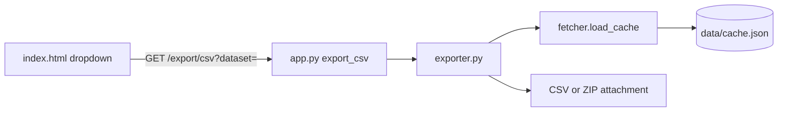

# CSV Cache Export Feature

## Goal

Let users download cached data from [`data/cache.json`](data/cache.json) as CSV via a UI dropdown: **Coins**, **News**, or **Both** (ZIP containing `coins.csv` + `news.csv`).

## Architecture



| File | Role |
|------|------|
| [`exporter.py`](exporter.py) | Build CSV bytes from cache (no Flask imports) |
| [`app.py`](app.py) | `GET /export/csv` route — validate input, return file response |
| [`templates/index.html`](templates/index.html) | Export dropdown in header |
| [`static/style.css`](static/style.css) | Match existing header/theme styles |

No new pip dependencies — use stdlib `csv`, `io`, and `zipfile`.

## CSV schemas

**coins.csv** columns (from current cache):

`id`, `symbol`, `name`, `current_price`, `price_change_percentage_24h`, `market_cap_rank`, `ath`, `ath_change_percentage`, `genesis_date`, `image`

**news.csv** columns:

`title`, `description`, `source`, `published_at`, `url`

- Use `csv.writer` with proper quoting for commas/newlines in news descriptions.
- Empty/missing fields → blank cell; `None` handled safely.
- If cache is empty, still return a valid CSV with headers only (200, not an error).

## [`exporter.py`](exporter.py) functions

- `VALID_DATASETS = {"coins", "news", "all"}`
- `build_coins_csv(coins: list) -> bytes` — UTF-8 with BOM optional (skip BOM for simplicity; Excel-friendly quoting via `csv` module)
- `build_news_csv(news: list) -> bytes`
- `build_export_zip(cache: dict) -> bytes` — `coins.csv` + `news.csv` inside `cryptox-cache-export.zip`
- `build_export(dataset: str) -> tuple[bytes, str, str]` — returns `(content, filename, mimetype)`
  - `coins` → `cryptox-coins-{date}.csv`, `text/csv`
  - `news` → `cryptox-news-{date}.csv`, `text/csv`
  - `all` → `cryptox-cache-{date}.zip`, `application/zip`
- Filename date from `cache["last_updated"]` (YYYYMMDD) or today's UTC date if missing.
- Call [`load_cache()`](fetcher.py) internally so exports always use normalized, safe data.

## Flask route ([`app.py`](app.py))

```python
@app.route("/export/csv")
def export_csv():
    dataset = request.args.get("dataset", "").strip().lower()
    if dataset not in VALID_DATASETS:
        return jsonify({"error": "dataset must be coins, news, or all."}), 400
    content, filename, mimetype = build_export(dataset)
    return Response(content, mimetype=mimetype, headers={
        "Content-Disposition": f'attachment; filename="{filename}"'
    })
```

- Import `Response` from `flask`.
- No business logic in the route beyond validation and calling `build_export()`.

## UI ([`templates/index.html`](templates/index.html))

Add a small Bootstrap dropdown next to the "Last updated" badge in the header:

- Label: **Export**
- Options:
  - Coins (CSV)
  - News (CSV)
  - Both (ZIP)
- Each option is a plain link: `/export/csv?dataset=coins` (etc.) — no JavaScript required; browser handles download.
- Include `last_updated_display` context unchanged; export always reflects current cache on the server.

## Styling ([`static/style.css`](static/style.css))

- `.export-dropdown` — match header panel colors, accent border, readable in light/dark themes (reuse CSS variables).

## Edge cases

| Case | Behavior |
|------|----------|
| Empty cache | CSV with headers only / ZIP with empty-header CSVs |
| Corrupt cache | `load_cache()` normalization already returns safe empty lists |
| Invalid `dataset` | 400 JSON error |
| News descriptions with quotes/commas | `csv.writer` quoting=`QUOTE_MINIMAL` or `QUOTE_NONNUMERIC` |

## Verification

1. `flask run` → Export **Coins** → open CSV in Excel/Sheets, 50 rows + header
2. Export **News** → 20 articles + header
3. Export **Both** → ZIP with two CSV files
4. Confirm existing routes (`/`, `/search`, favorites, modal) unchanged
5. Test with empty cache skeleton — download still succeeds with headers only

## Out of scope (keep diff minimal)

- Exporting favorites (`data/favorites.json`) — separate feature
- Client-side CSV generation — server reads authoritative cache
- Writing export files to disk — stream bytes directly in HTTP response

## Plan file

Saved to [`.cursor/plans/csv-cache-export.plan.md`](.cursor/plans/csv-cache-export.plan.md) on confirm.
